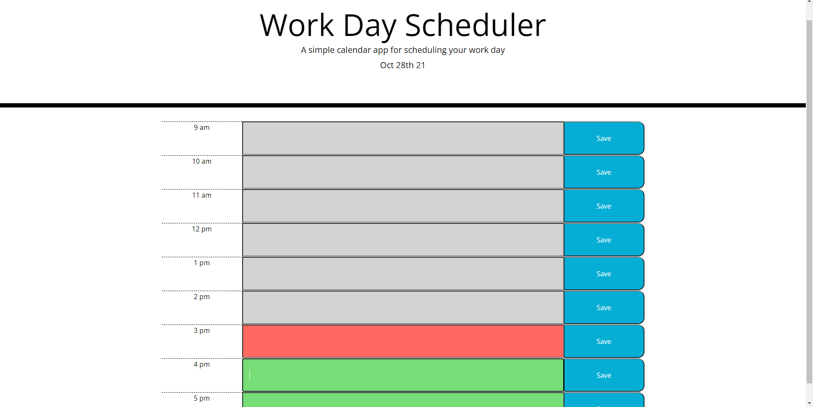
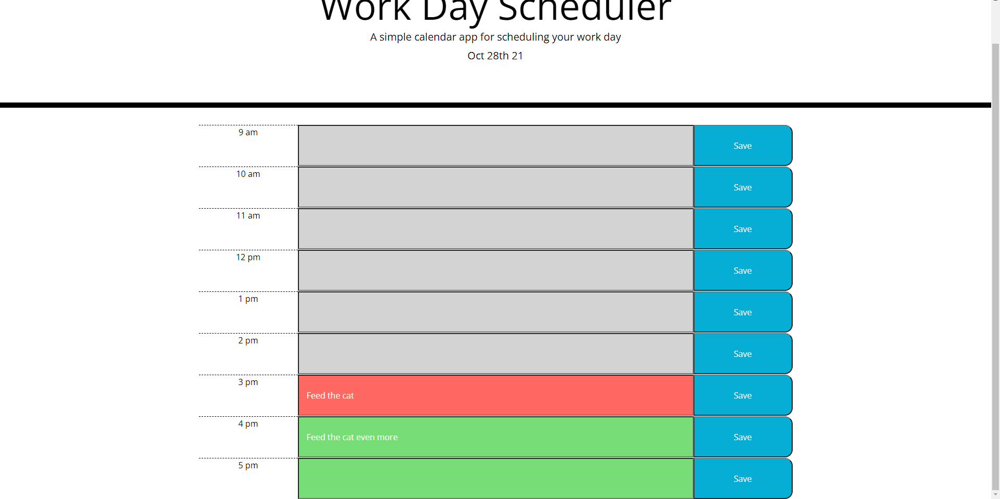

# Schedule Planner

## Description

My project can be viewed [here](https://mcktayl.github.io/schedule-planner/).

The schedule planner allows the user to save their daily plans to local storage so that it will remain upon refreshing/reloading. This project can increase time management and organization, leading to higher productivity overall.

## Table of Contents

- [Installation](#installation)
- [Usage](#usage)
- [Credits](#credits)
- [License](#license)

## Installation

This application runs in the browser and requires no installation by the user.

## Usage

A video demonstration can be viewed [here](https://user-images.githubusercontent.com/91210267/139353420-cd6dc8ce-652c-4f55-aeba-cbcefda2d034.mp4).

Upon loading, the user is presented with the date and a series of time blocks in which to write their plans/appointments. The blocks are color coded according to the hour (grey when that hour has passed, red when currently in that hour, and green if that hour is in the future). The user can click "save" to save the text entered in that hour to local storage.

## Credits

- [https://newbedev.com/convert-12-hour-am-pm-string-to-24-date-object-using-moment-js](https://newbedev.com/convert-12-hour-am-pm-string-to-24-date-object-using-moment-js)
- [https://stackoverflow.com/questions/13524107/how-to-set-data-attributes-in-html-elements](https://stackoverflow.com/questions/13524107/how-to-set-data-attributes-in-html-elements)
- [https://www.section.io/engineering-education/how-to-use-localstorage-with-javascript/](https://www.section.io/engineering-education/how-to-use-localstorage-with-javascript/)

## License

MIT License

Copyright (c) [2021] Kenzie Cottrell

Permission is hereby granted, free of charge, to any person obtaining a copy
of this software and associated documentation files (the "Software"), to deal
in the Software without restriction, including without limitation the rights
to use, copy, modify, merge, publish, distribute, sublicense, and/or sell
copies of the Software, and to permit persons to whom the Software is
furnished to do so, subject to the following conditions:

The above copyright notice and this permission notice shall be included in all
copies or substantial portions of the Software.

THE SOFTWARE IS PROVIDED "AS IS", WITHOUT WARRANTY OF ANY KIND, EXPRESS OR
IMPLIED, INCLUDING BUT NOT LIMITED TO THE WARRANTIES OF MERCHANTABILITY,
FITNESS FOR A PARTICULAR PURPOSE AND NONINFRINGEMENT. IN NO EVENT SHALL THE
AUTHORS OR COPYRIGHT HOLDERS BE LIABLE FOR ANY CLAIM, DAMAGES OR OTHER
LIABILITY, WHETHER IN AN ACTION OF CONTRACT, TORT OR OTHERWISE, ARISING FROM,
OUT OF OR IN CONNECTION WITH THE SOFTWARE OR THE USE OR OTHER DEALINGS IN THE
SOFTWARE.
